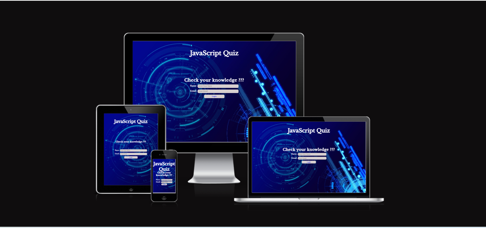
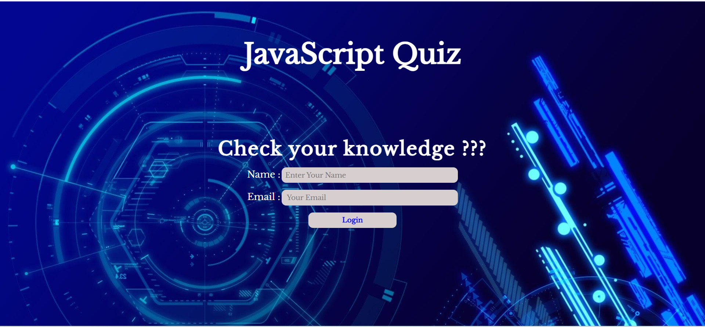
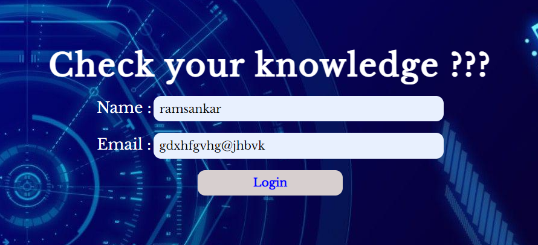
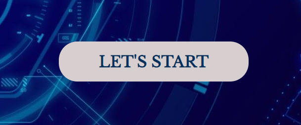
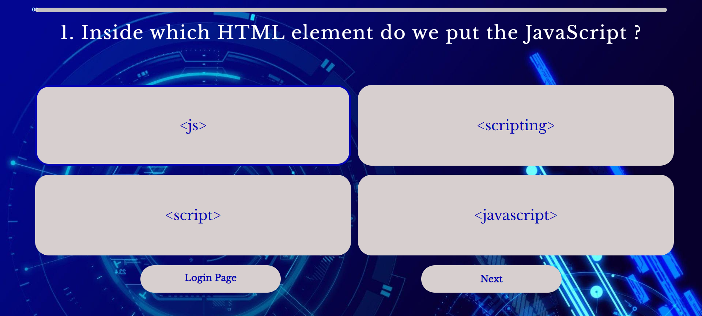
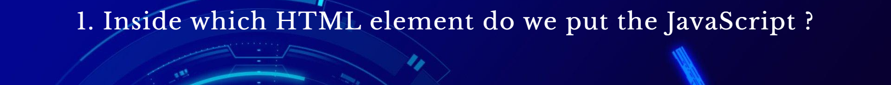
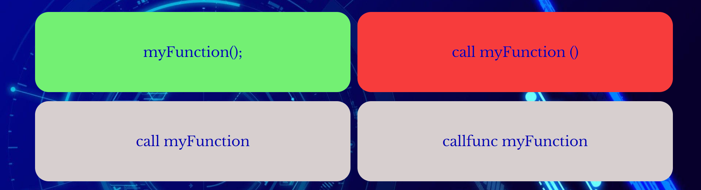
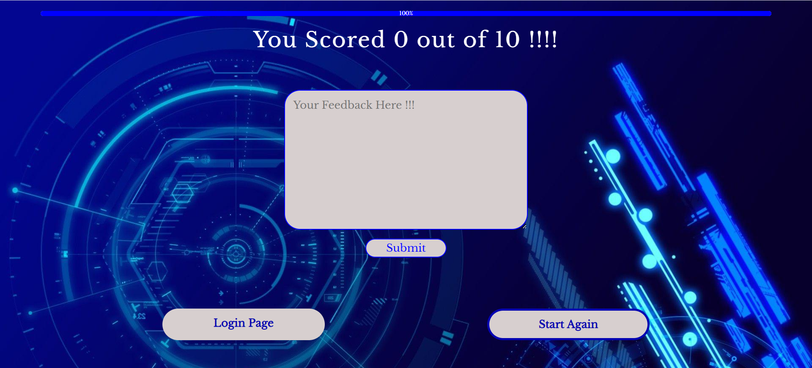
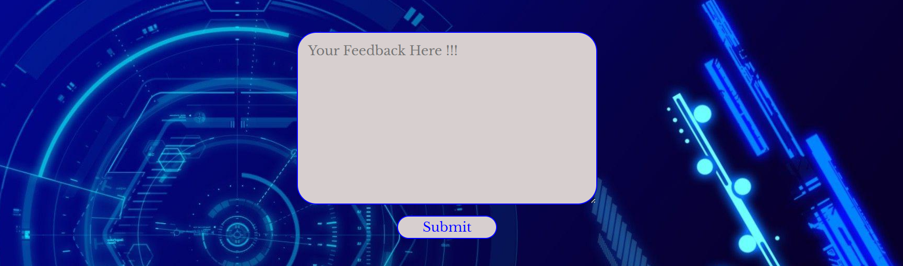
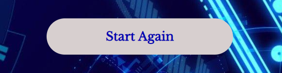

# Javascript Quiz

JavaScript Quiz is an online quiz based on basics of javascript.

## DEMO
---
A live demo of the site can be found [here.](https://sari-rahul.github.io/online-quiz/)

## LANGUAGES USED

---

- HTML
- CSS
- Javascript

## FEATURES

---

There are Three pages in this website. The main features of this website are as follows:

### 1. Login Page
The first page in the website which shows the heading and has a form in it.

#### Form
---
The login page has a form in it which the user uses to fill in the details. The name and email address of the user is asked in the form.

#### Lets Start Button
---
Once the user submits thte form, a button appears below the form which helps to start the quiz.
Once the user clicks this button the quiz starts by displaying the first question

### 2.Quiz Page
---
The second page of the website.
It has five parts.
+ Progress bar
+ Question container
+ Answer container
+ Button Container
  

#### Progress Bar
---
It shows the users progress in the quiz.It is at the 0% position in the beginning and increases once the user clicks the next button and gets the next question.
It also displays the percentage of complation inside it.

#### Question Container
---
The most imaportant part of the quiz is the quiz container. It displays the question to the user one by one when the user clicks the next question button.

#### Answer Container
---
It displays the answer options according to the questions.The are Four options displayed for each question.
The border of each button turns blue while hovering above it.

The user can click on these buttons.

If the clicked button contains the correct answer it turns green and turns red if it contains the wrong answer.

#### Button Container
---
It contains two buttons.

+ Login page button
+ Next Question button

##### Login page button
---
This button when clicked takes the user to the login page or the initial page. They can login the website again and start the quiz from the beginning.

It appears on the screen till the user completes the quiz and disappears when the score is displayed.
##### Next Question button
---
This button when clicked by the user the next question is displayed.
It appears till the last question and one the not present on the score displaying page.

### 3. Score Page
---
Once the user completes the quiz the score page is displayed. The features of Score page are:
+ Progrees Bar
+ The Score bar
+ The Feedback area
+ StartAgain button
+ Exit Button

  
#### The Progress Bar
---
As the user has completed quiz the progress bar shows 100%.

#### The Score bar
---
The Score bar diaplays the score of the user out of the totoal number of questions in the quiz.

#### The Feedback area
---
The users feedback can be entered here and submitted using the button in the form.

#### Start Again button
---
The Start again button can be clicked if the user wants to play once again.

If this button is clicked the questions will be displayed from the beginning and the user can play once again.

#### Exit button
---
If the game is to be continued by another user they can click the exit button and go the login page page add their details and start the game again or they can just exit the game.

 
## TESTING

---

### Lighthouse

---

This project has been tested throughly using the dev tools during the development process and has behaved accordingly in all required screen sizes. After completion it has been tested in lighthouse and has a good score for accessibilty, performance,SEO and Best practices.

- [Lighthouse test of landing page.](assets/images/lighthouseforlandingpage.png)
- [Lighthouse test of quiz page.](assets/images/lighthouseforquizpage.png)

### Full Testing

---

Full testing was performed on the following devices:

- Laptop:
  - HP 15-dw3205ng Notebook
- Mobile Devices:
  - iPhone 11 pro max.
  - Vivo Y73.

Each device tested the site using the following browsers:

- Google Chrome
- Safari
- Microsoft Edge

### Validator Testing

---

#### HTML

No errors have been found while passing through official [W3C Validator.](https://validator.w3.org/nu/?doc=https%3A%2F%2Fsari-rahul.github.io%2Fonline-quize%2F)

#### CSS

- No errors have been found while passing through official [jigaw validator.](https://jigsaw.w3.org/css-validator/validator?uri=+https%3A%2F%2Fsari-rahul.github.io%2Fonline-quize%2F&profile=css3svg&usermedium=all&warning=1&vextwarning=&lang=en)

#### Javascript

No errors have been found while passing through official Jshint validator.
+ [Jshint validator page1.](assets/images/jshintpage1.png)
+ [Jshint validator page2.](assets/images/jshintpage2.png)

### Manual Testing

---

| Feature               | Expected Outcome                                                                                                             | Testing Performed    | Result                           | Pass/Fail |
| --------------------- | ---------------------------------------------------------------------------------------------------------------------------- | -------------------- | -------------------------------- | --------- |
| `Landing page Form`              |
|Login Button |Asks to enter name and email address to start the game and displays the lets start button|Clicked the button after entering the name and email address|Lets start button displayed|Pass|
|`Quiz Page`|
|Progress Bar|At base position with 0% written and increases as the users goes through the quiz by clicking next button|Next button clicked|Increses the width|Pass|
|Question container|Should display each question and its number when the next button is clicked|Clicked next button|Displayed a different question and its number|Pass|
|`Answer Container`|
|Answer buttons|Should display differnt options as per the question when the next button is clicked|Next button clicked|Displays the options of next question|Pass|
|Answer button Hover|They should show blue borders when hovered|Hovered|Blue border appeared|Pass|
|Answer Button Background|the background of the answer button clicked should turn green if the clicked answer is true |Clicked the correct answer.|The background turned green|Pass|
|Answer Button Background|the background of the answer button clicked should turn red if the clicked answer is false and the write answers button turns green. |Clicked the wrong answer.|The background of the clicked button turned red and that of correct answer turned green.|Pass|
|Login button|When clicked should take to the landing page and allow the user to reenter the name and email address.|Clicked the button.|The landing page opened.|Pass|
|Next Button|When clicked should display the next question as well as the coressponding answer buttons.|Clicked the next button.|The next question and the respective answer button displayed.|Pass|
|`Score Page`|
|Progress Bar|Should show 100%.|completed the quiz.|Shows 100%|Pass.|
|Score Bar|Should show the score of the user.|Completed the quiz.|Shows the score.|Pass|
|Feedback Area|Should display with a submit button once the quiz is completed|Quiz completed|It appears along with the submit button|Pass||Login button|When clicked should take to the landing page and allow the user to reenter the name and email address.|Clicked the button.|The landing page opened.|Pass|
Login button|When clicked should take to the landing page and allow the user to reenter the name and email address.|Clicked the button.|The landing page opened.|Pass|
|Start Again Button|When clicked should display the questions as well as the coressponding answer buttons again.|Clicked the next button.|The next question and the respective answer button displayed.|Pass|

## BUGS
---
|No. |Bug seen          |Correction done   |Pass/Fail
|-------| ----------------------------- | ------------------------------------------------------------------------------------------------------------------------------------ | ------------------------------------- |
|1.|Display of the lets start button was not clear,It was appearing and then suddenly disappearing|At first both html pages were linked to same script page,Later it was separated and both pages were linked to seperate script pages|Pass|
|2.|Progress bar was showing decimal values|Added Math.round() to get the rounded values|Pass|
|3.| 

## DEPLOYMENT

---

This project was deployed first on 24th of August 2023 in the Github platform.
The steps of deployment are as follows:

- In the github ,select the repository.
- Go to the settings ,select Pages from the left side.
- In pages ,change the Branch into main and Save it.
- Wait for few minutes and the link to the repository will be loaded above.

The live link can be found [here.](https://sari-rahul.github.io/online-quiz/)

## CREDITS

---

The credits of this projects are:

### Content

- The content of this project was refferd from W3Schools websites.

+ The instructions for implementation was taken from the [Great Stack](https://www.youtube.com/watch?v=PBcqGxrr9g8&t=11s&ab_channel=GreatStack)  youtube channel.

  